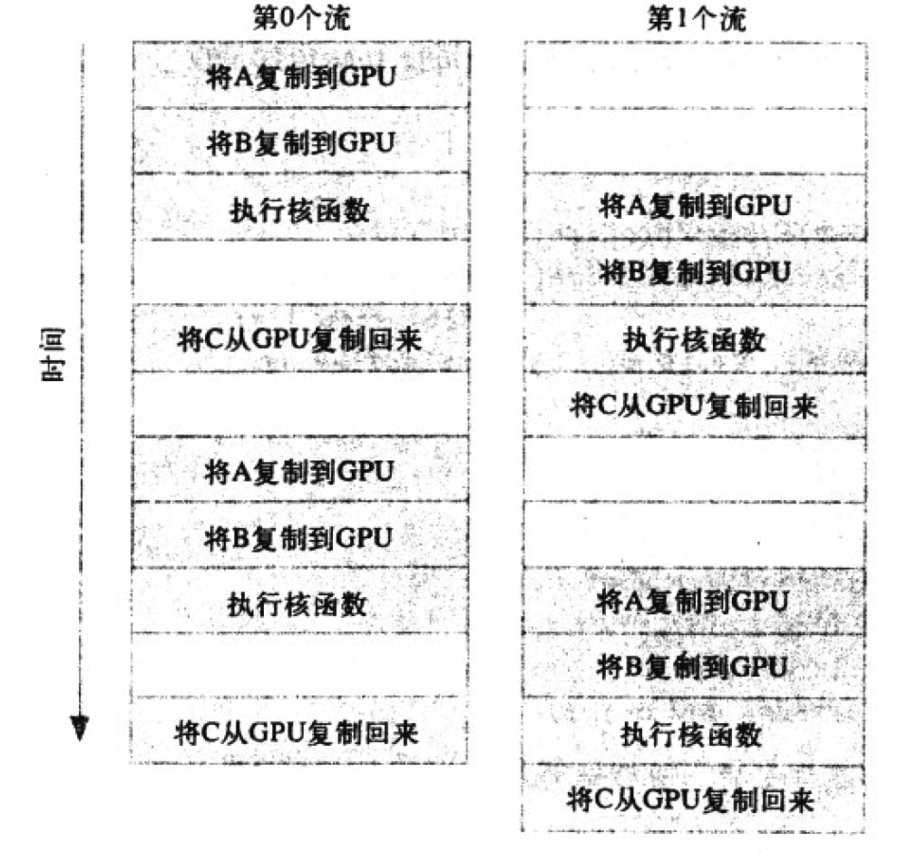
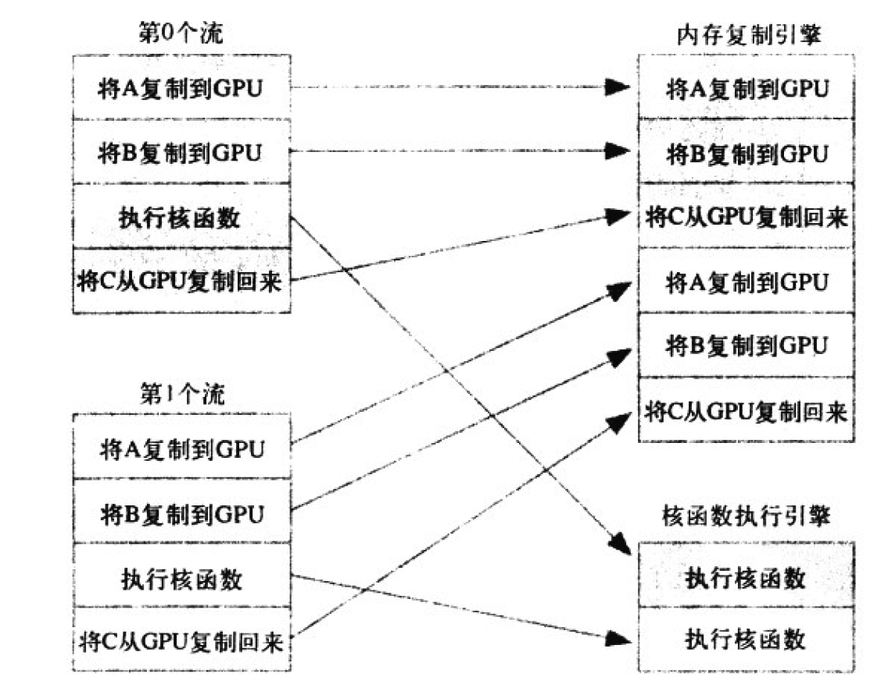
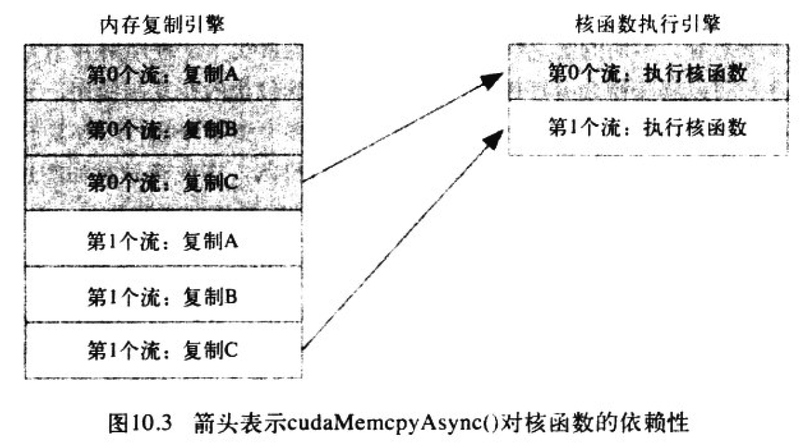
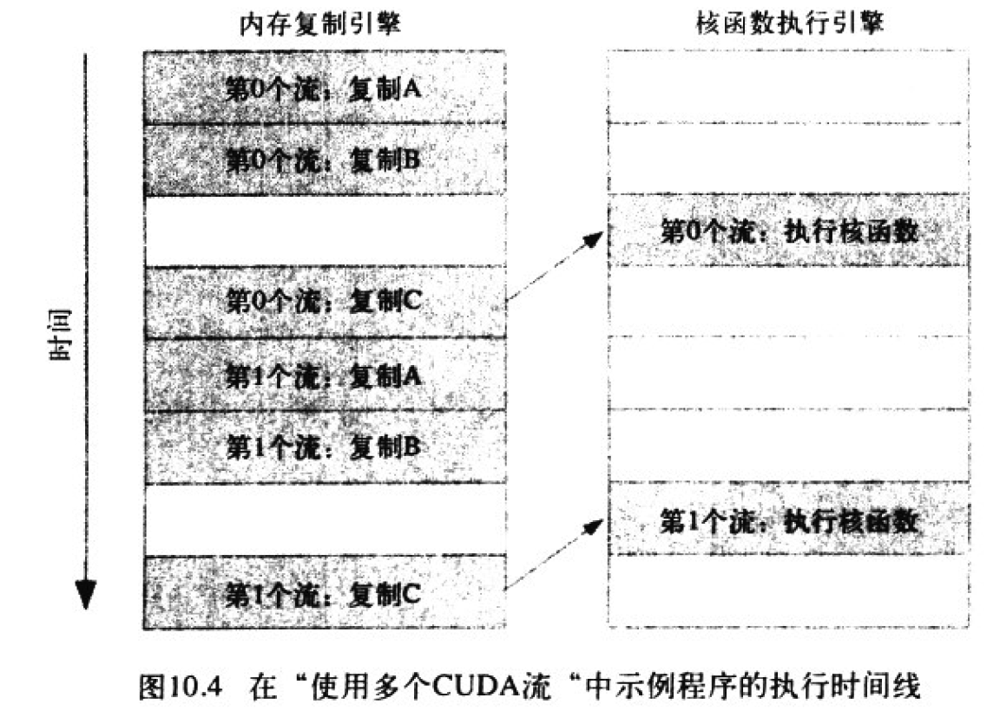
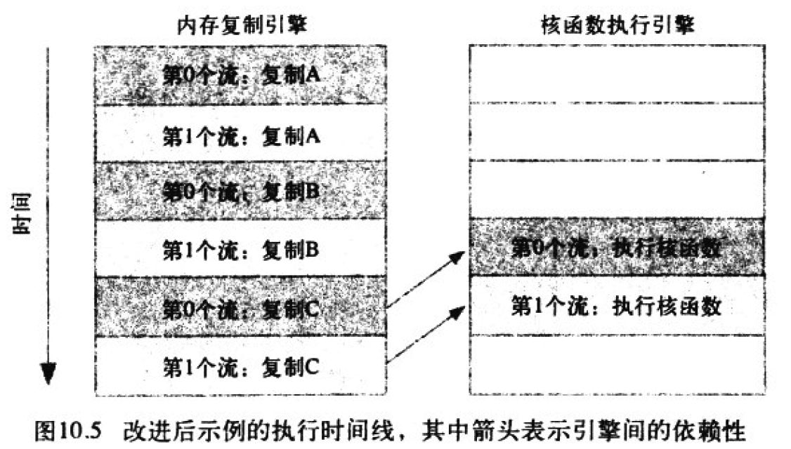

在并行环境中，任务可以是任意操作。例如，应用程序可以执行两个任务：其中一个线程重绘程序的GUI，而另一个线程通过网络下载更新包。这些任务并行执行，彼此之间没有任何共同的地方。虽然GPU上的任务并行性并不像CPU上的任务并行性那样灵活，但仍然可以进一步提高程序在GPU上的运行速度。本章将介绍CUDA流，以及如何通过流在GPU上同时执行多个任务。

<!-- more -->


## 页锁定(Page-Locked)主机内存

CUDA提供了自己独有的机制来分配主机内存：cudaHostAlloc()。malloc()分配的内存与cudaHostAlloc()分配的内存之间存在一个重要差异。C库函数malloc()将分配标准的、可分页的(Pagable)主机内存，而cudaHostAlloc()将分配页锁定的主机内存。页锁定内存也称为固定内存(Pinned Memory)或者不可分页内存，它有一个重要属性：操作系统将不会对这块内存分页并交还到磁盘上，从而确保了该内存始终驻留在物理内存中。因此，操作系统能够安全地使某个应用程序访问该内存的物理地址，因为这块内存将不会被破坏或者重新定位。

由于GPU知道内存的物理地址，因此可以通过“直接内存访问（Direct Memory Access，DMA）”技术来在GPU和主机之间复制数据。由于DMA在执行复制时无需CPU的介入，这也就意味着，CPU很可能在DMA的执行过程中将目标内存交换到磁盘上，或者通过更新操作系统的分页来重新定位目标内存的物理地址。CPU可能会移动可分页的数据，这就可能对DMA操作造成延迟。因此，在DMA复制过程中使用固定内存时非常重要的。

事实上，当使用可分页内存进行复制时，CUDA驱动程序仍然会通过DAM把数据传输给GPU。因此，复制操作将执行两遍，第一遍从可分页内存复制到一块“临时的”页锁定内存，然后再从这个页锁定内存复制到GPU上。因此，**每当从可分页内存中执行复制操作时，复制速度将受限于PCIE（高速串行计算机扩展总线标准）传输速度和系统前端总线速度相对较低的一方。当在GPU和主机间复制数据时，这种差异会使页锁定主机内存的性能比标准可分页内存的性能要高达约2倍。**计时PCIE的速度与前端总线的速度相等，由于可分页内存需要更多一次由CPU参与的复制操作，因此会带来额外的开销。

然而，使用cudaHostAlloc()分配固定内存时，将失去虚拟内存的所有功能。特别是在应用程序中使用每个页锁定内存时都需要分配物理内存，因为这些内存不能交换到磁盘上。这意味着与使用标准的malloc()调用相比，系统将更快地耗尽内存。因此，应用程序在物理内存较少的机器上会运行失败，而且意味着应用程序将影响在系统上运行的其他应用程序的性能。建议仅对cudaMemcpy()调用中的源内存或者目标内存才使用页锁定内存，并且在不再需要使用它们时立即释放，而不是等到应用程序关闭时才释放。


下面给的例子来说明如何分配固定内存，以及它相对于标准可分页内存的性能优势。这个例子主要是测试cudaMemcpy()在可分配内存和页锁定内存上的性能。我们要做的就是分配一个GPU缓冲区以及一个大小相等的主机缓冲区，然后两个缓冲区之间执行一些复制操作（从主机到设备、从设备到主机）。为了获得精确的时间统计，我们为复制操作的起始时刻和结束时刻分别设置了CUDA事件。

```c
float cuda_malloc_test(int size, bool up){
    cudaEvent_t start, stop;
    int *a, *dev_a;
    float elapsedTime;
    
    HANDLE_ERROR(cudaEventCreate(&start));
    HANDLE_ERROR(cudaEventCreate(&stop));
    
    a = (int*)malloc(size * sizeof(*a));
    HANDLE_NULL(a);
    HANDLE_ERROR(cudaMalloc((void**)&dev_a, size * sizeof(&dev_a)));
    
    HANDLE_ERROR(cuddaEventRecord(start, 0));
    
    //为size个整数分别分配主机缓冲区和GPU缓冲区，然后执行100次复制操作，并由参数up来指定复制方向，在完成复制操作后停止计时器
    for(int i = 0; i < 100; i++){
        if(up){
            HANDLE_ERROR(cudaMemcpy(dev_a, a, size * sizeof(*dev_a), cudaMemcpyHostToDevice));
        }
        else{
            HANDLE_ERROR(cudaMemcpy(a, dev_a, size * sizeof(*dev_a), cudaMemcpyDeviceToHost));
        }
    }
    HANDLE_ERROR(cudaEventRecord(stop, 0));
    HANDLE_ERROR(cudaEventSynchronize(stop));
    HANDLE_ERROR(cudaEventElapsedTime(&elapsedTime, start, stop));
    
    free(a);
    HANDLE_ERROR(cudaFree(dev_a));
    HANDLE_ERROR(cudaEventDestroy(start));
    HANDLE_ERROR(cudaEventDestroy(stop));
    
    return elapsedTime;
}
```

函数cuda_malloc_test()通过标准的C函数malloc()来分配可分页主机内存，在分配固定内存时则使用了cudaHostAlloc()。

```c
float cuda_host_alloc_test(int size, bool up){
    cudaEvent_t start, stop;
    int *a, *dev_a;
    float elapsedTime;
    
    HANDLE_ERROR(cudaEventCreate(&start));
    HANDLE_ERROR(cudaEventCreate(&stop));
    
    HANDLE_ERROR(cudaHostAlloc((void**)&a, size * sizeof(*a), cudaHostAllocDefault));
    HANDLE_ERROR(cudaMalloc((void**)&dev_a, size * sizeof(*dev_a)));
    HANDLE_ERROR(cudaEventRecord(start, 0));
    
    for(int i = 0; i < 100; i++){
        if(up){
            HANDLE_ERROR(cudaMemcpy(dev_a, a, size * sizeof(*dev_a), cudaMemcpyHostToDevice));
        }
        else{
            HANDLE_ERROR(cudaMemcpy(a, dev_a, size * sizeof(*dev_a), cudaMemcpyDeviceToHost));
        }
    }
    HANDLE_ERROR(cudaEventRecord(stop, 0));
    HANDLE_ERROR(cudaEventSynchronize(stop));
    HANDLE_ERROR(cudaEventElapsedTime(&elapsedTime, start, stop));
    
    
    HANDLE_ERROR(cudaFreeHost(a));
    
    HANDLE_ERROR(cudaFree(dev_a));
    HANDLE_ERROR(cudaEventDestroy(start));
    HANDLE_ERROR(cudaEventDestroy(stop));
    
    return elapsedTime;
}
```

cudaHostAlloc()分配的内存与malloc()分配的内存在使用方式是相同的，与malloc()不同之处在于最后一个参数cudaHostAllocDefault。最后一个参数的取值范围是一组标志，我们可以通过这些标志来修改cudaHostAlloc()的行为，并分配不同形式的固定主机内存。就目前而言，只需使用默认值。最后需要使用cudaFreeHost()来释放内存。

main()函数的代码如下：

```c
#include "../common/book.h"

#define SIZE (10 * 1024 * 1024)

int main(){
    float elapsedTime;
    float MB = (float)100 * SIZE * sizeof(int) / 1024 / 1024;
    elapsedTime = cuda_malloc_test(SIZE, true);
    printf("Time using cudaMalloc: %3.1fms\n", elapsedTime);
    printf("\tMB/s during copy up: %3.1f\n", MB / (elapsedTime / 1000));
    //要执行相反方向的性能，可以执行相同的调用，只需要将第二个参数指定为false
    elapsedTime = cuda_malloc_test(SIZI, false);
    printf("Time using cudaMalloc: %3.1f ms \n", elapsedTime);
    printf("\tMB/s during copy down: %3.1f\n", MB / (elapsedTime / 1000));
    
    //测试cudaHostAlloc()的性能
    elapsedTime = cuda_host_malloc_test(SIZE, true);
    printf("Time using cudaHostMalloc: %3.1fms\n", elapsedTime);
    printf("\tMB/s during copy up: %3.1f\n", MB / (elapsedTime / 1000));
    
    elapsedTime = cuda_host_malloc_test(SIZI, false);
    printf("Time using cudaHostMalloc: %3.1f ms \n", elapsedTime);
    printf("\tMB/s during copy down: %3.1f\n", MB / (elapsedTime / 1000));
}
```


## CUDA流

之前介绍过cudaEventRecord()，并没有详细解释这个函数的第二个参数，这个第二个参数是用于指定插入事件的流(Stream)。CUDA流表示一个GPU操作队列，并且该队列中的操作将以指定的顺序执行。我们可以在流中添加一些操作，例如核函数启动、内存复制，以及时间的启动和结束等。你可以将每个流视为GPU上的一个任务，并且这些任务可以并行执行。我们将首先介绍如何使用流，然后介绍如何使用流来加速应用程序。


### 使用单个CUDA流

仅当使用多个流时才能显现出流的真正威力。不过我们先用一个流来说明用法。下面的示例中，我们将计算a中三个值和b中三个值的平均值。

```c
#include "../common/book.h"

#define N (1024 * 1024)
#define FULL_DATA_SIZE (N * 20)

__global__ void kernel(int *a, int *b, int *c){
    int idx = threadIdx.x + blockIdx.x * blockDim.x;
    if(idx < N){
        int idx1 = (idx + 1) % 256;
        int idx2 = (idx + 2) % 256;
        float as = (a[idx] + a[idx1] + a[idx2]) / 3.0f;
        float bs = (b[idx] + b[idx1] + b[idx2]) / 3.0f;
        c[idx] = (as + bs) / 2;
    }
}

int main(){
    //选择一个一个支持设备重叠功能的设备。支持设备重叠功能的GPU能够在执行一个CUDA C核函数的同时，
    //还能在设备与主机之间执行复制操作。	
    cudaDeviceProp prop;
    int whichDevice;
    HANDLE_ERROR(cudaGetDevice(&whichDevice));
    HANDLE_ERROR(cudaGetDeviceProperties(&prop, whichDevice));
    if(!prop.deviceOverlap){
        printf("Device will not handle overlaps, so no speed up from streams\n");
    }
    
    cudaEvent_t start, stop;
    float elapsedTime;
    
    //启动计时器
    HANDLE_ERROR(cudaEventCreate(&start));
    HANDLE_ERROR(cudaEventCreate(&stop));
    HANDLE_ERROR(cudaEventRecord(start, 0));
    
    //初始化流
    cudaStream_t stream;
    HANDLE_ERROR(cudaStreamCreate(&stream));
    
    //数据分配操作
    int *host_a, *host_b, *host_c;
    int *dev_a, *dev_b, *dev_c;
    
    //在GPU上分配内存
    HANDLE_ERROR(cudaMalloc((void**)&dev_a, N * sizeof(int)));
    HANDLE_ERROR(cudaMalloc((void**)&dev_b, N * sizeof(int)));
    HANDLE_ERROR(cudaMalloc((void**)&dev_c, N * sizeof(int)));
    
    //分配由流使用的页锁定内存
    HANDLE_ERROR(cudaHostAlloc((void**)&host_a, FULL_DATA_SIZE * sizeof(int), cudaHostAllocDefault));
    HANDLE_ERROR(cudaHostAlloc((void**)&host_b, FULL_DATA_SIZE * sizeof(int), cudaHostAllocDefault));
    HANDLE_ERROR(cudaHostAlloc((void**)&host_c, FULL_DATA_SIZE * sizeof(int), cudaHostAllocDefault));
    
    for(int i = 0; i < FULL_DATA_SIZE; i++){
        host_a[i] = rand();
        host_b[i] = rand();
    }

```

程序将使用主机上的固定内存。我们还会使用一种新的cudaMemcpy()函数，并且在这个新函数中需要页锁定主机内存。在分配完输入内存后，调用C的库函数rand()并用随机证书填充主机内存。

执行计算的方式是将两个输入缓冲区复制到GPU，启动核函数，然后将输出缓冲区复制回主机。不过，本示例做出了小的调整。首先，我们不将输入缓冲区整体都复制到GPU，而是将输入缓冲区划分为更小的块，并在每个块上执行一个包含三个步骤的过程。我们将一部分输入缓冲区复制到GPU，在这部分缓冲区上运行核函数，然后将输出缓冲区的这部分结果复制回主机。下面给出了一个需要这种方法的情形：GPU的内存远少于主机内存，由于整个缓冲区无法一次性填充到GPU，因此需要分块进行计算。执行“分块”计算的代码如下所示：

```c
    //在整体数据上循环，每个数据块的大小为N
    for(int i = 0; i < FULL_DATA_SIZE; i += N){
        //将锁定内存以异步的方式复制到设备上
        HANDLE_ERROR(cudaMemcpyAsync(dev_a, host_a + i, N * sizeof(int), cudaMemcpyHostToDevice, stream));
        HANDLE_ERROR(cudaMemcpyAsync(dev_b, host_b + i, N * sizeof(int), cudaMemcpyHostToDevice, stream));
        kernel<<<N / 256, 256, 0, stream>>>(dev_a, dev_b, dev_c);

        //将数据从设备复制到锁定内存
        HANDLE_ERROR(cudaMemcpyAsync(host_c + i, dev_c, N * sizeof(int), cudaMemcpyDeviceToHost. stream));
	}
```

上述代码使用cudaMemcpyAsync()在GPU与主机之间复制数据。cudaMemcpy()的行为类似于C库函数memcpy()，尤其是这个函数将以同步的方式进行。这意味着当函数返回时，复制操作就已经完成，并且在输出缓冲区中包含了复制进去的内容。异步函数的行为与同步函数相反，在调用cudaMemcpyAsync()时，只是放置一个请求，表示在流中执行一次内存复制操作，这个流时通过参数stream来指定的。当函数返回时，我们无法确保复制操作是否已经启动，更无法保证它是否已经结束。**我们能够得到的保证是，复制操作肯定会将肯定会当下一个被放入流中的操作之前执行。**任何传递给cudaMemcpyAsync()的主机内存指针都必须已经通过cudaHostAlloc()分配好内存。也就是，**你只能以异步方式对页锁定内存进行复制操作。**

在核函数调用的尖括号中还可以带有一个流参数。此时核函数调用将是异步的。从技术上来说，当循环迭代完一次时，有可能不会启动任何内存复制或核函数执行。**我们能够确保的是，第一次放入流中的复制操作将在第二次复制操作之前执行。此外，第二个复制操作将在核函数启动之前完成。而核函数将在第三次复制操作开始之前完成。**

当for循环结束时，在队列中应该包含了许多等待GPU执行的工作。如果想要确保GPU执行完了计算和内存复制等操作，那么就需要将GPU与主机同步。也就是说，主机在继续执行之前，要首先等待GPU执行完成。可以调用cudaStreamSynchronize()并制定想要等待的流。当程序执行到stream与主机同步之后的代码时，所有的计算和复制操作都已经完成，因此停止计时器，收集性能数据，并释放输入缓冲区和输出缓冲区。

```c
    //将计算结果从页锁定内存复制到主机内存
    HANDLE_ERROR(cudaStreamSynchronize(stream));

    HANDLE_ERROR(cudaEventRecord(stop, 0));
    HANDLE_ERROR(cudaEventSynchronize(stop));
    HANDLE_ERROR(cudaEventElapsedTime(&elapsedTime, start, stop));
    printf("Time taken: 3.1%f ms\n", elapsedTime);

    //释放流和内存
    HANDLE_ERROR(cudaFreeHost(host_a));
    HANDLE_ERROR(cudaFreeHost(host_b));
    HANDLE_ERROR(cudaFreeHost(host_c));
    HANDLE_ERROR(cudaFree(dev_a));
    HANDLE_ERROR(cudaFree(dev_b));
    HANDLE_ERROR(cudaFree(dev_c));

    //销毁对GPU操作进行排队的流
    HANDLE_ERROR(cudaStreamDestroy(stream));

}
```


### 使用多个CUDA流

我们将上面的示例改为使用两个不同的流。我们将实现：在第0个流执行核函数的同时，第1个流将输入缓冲区复制到GPU。然后在第0个流将计算结果复制回主机的同时，第1个流将执行核函数。接着，第1个流将计算结果复制回主机，同时第0个流开始在下一块数据上执行核函数。假设内存复制操作和核函数执行的事件大致相同，那么应用程序的执行时间线将如图下所示（后续图片中函数调用cudaMemcpyAsync()被简写为复制）：



核函数的代码保持不变。与使用单个流的版本一样，我们将判断设备是否支持计算与内存复制操作的重叠。如果设备支持重叠，那么就像前面一样创建CUDA事件并对应用程序计时。创建两个流的方式与之前代码中创建单个流的方式是一样的。

```c
#include "../common/book.h"

#define N (1024 * 1024)
#define FULL_DATA_SIZE (N * 20)

__global__ void kernel(int *a, int *b, int *c){
    int idx = threadIdx.x + blockIdx.x * blockDim.x;
    if(idx < N){
        int idx1 = (idx + 1) % 256;
        int idx2 = (idx + 2) % 256;
        float as = (a[idx] + a[idx1] + a[idx2]) / 3.0f;
        float bs = (b[idx] + b[idx1] + b[idx2]) / 3.0f;
        c[idx] = (as + bs) / 2;
    }
}

int main(){
    cudaDeviceProp prop;
    int whichDevice;
    HANDLE_ERROR(cudaGetDevice(&whichDevice));
    HANDLE_ERROR(cudaGetDeviceProperties(&prop, whichDevice));
    if(!prop.deviceOverlap){
        printf("Device will not handle overlaps, so no speed up from streams\n");
    }
    
    cudaEvent_t start, stop;
    float elapsedTime;
    
    //启动计时器
    HANDLE_ERROR(cudaEventCreate(&start));
    HANDLE_ERROR(cudaEventCreate(&stop));
    HANDLE_ERROR(cudaEventRecord(start, 0));
    
    //初始化流
    cudaStream_t stream0, stream1;
    HANDLE_ERROR(cudaStreamCreate(&stream0));
    HANDLE_ERROR(cudaStreamCreate(&stream1));
    
    //数据分配操作
    int *host_a, *host_b, *host_c;
    int *dev_a0, *dev_b0, *dev_c0; //为第0个流分配的GPU内存
    int *dev_a1, *dev_b1, *dev_c1; //为第1个流分配的GPU内存
    
    //在GPU上分配内存
    HANDLE_ERROR(cudaMalloc((void**)&dev_a0, N * sizeof(int)));
    HANDLE_ERROR(cudaMalloc((void**)&dev_b0, N * sizeof(int)));
    HANDLE_ERROR(cudaMalloc((void**)&dev_c0, N * sizeof(int)));
    HANDLE_ERROR(cudaMalloc((void**)&dev_a1, N * sizeof(int)));
    HANDLE_ERROR(cudaMalloc((void**)&dev_b1, N * sizeof(int)));
    HANDLE_ERROR(cudaMalloc((void**)&dev_c1, N * sizeof(int)));
    
    //分配由流使用的页锁定内存
    HANDLE_ERROR(cudaHostAlloc((void**)&host_a, FULL_DATA_SIZE * sizeof(int), cudaHostAllocDefault));
    HANDLE_ERROR(cudaHostAlloc((void**)&host_b, FULL_DATA_SIZE * sizeof(int), cudaHostAllocDefault));
    HANDLE_ERROR(cudaHostAlloc((void**)&host_c, FULL_DATA_SIZE * sizeof(int), cudaHostAllocDefault));
    
    for(int i = 0; i < FULL_DATA_SIZE; i++){
        host_a[i] = rand();
        host_b[i] = rand();
    }
```

之后，程序在输入数据块上循环。然而，由于现在使用了两个流，因此在for()循环的迭代中需要处理的数据量也是原来的两倍。在stream()中，我们首先将a和b的异步复制操作放入GPU的队列，然后将一个核函数执行放入队列，接下来再将一个复制回c的操作放入队列：

```c
    //在整体数据上循环，每个数据块的大小为N
    for(int i = 0; i < FULL_DATA_SIZE; i += N * 2){
        //将锁定内存以异步方式复制到设备上
        HANDLE_ERROR(cudaMemcpyAsync(dev_a0, host_a + i, N * sizeof(int), cudaMemcpyHostToDevice, stream0));
        HANDLE_ERROR(cudaMemcpyAsync(dev_b0, host_b + i, N * sizeof(int), cudaMemcpyHostToDevice, stream0));
        kernel<<<N / 256, 256, 0, stream0>>>(dev_a0, dev_b0, dev_c0);

        //将数据从设备复制回锁定内存
        HANDLE_ERROR(cudaMemcpyAsync(host_c + i, dev_c0, N * sizeof(int), cudaMemcpyDeviceToHost, stream0));

        //在将这些操作放入stream0队列后，再把下一个数据块上的相同操作放入stream1的队列中

        //将锁定内存以异步方式复制到设备上
        HANDLE_ERROR(cudaMemcpyAsync(dev_a1, host_a + i + N, N * sizeof(int), cudaMemcpyHostToDevice, stream1));
        HANDLE_ERROR(cudaMemcpyAsync(dev_b1, host_b + i + N, N * sizeof(int), cudaMemcpyHostToDevice, stream1));
        kernel<<<N / 256, 256, 0, stream1>>>(dev_a1, dev_b1, dev_c1);

        //将数据从设备复制回锁定内存
        HANDLE_ERROR(cudaMemcpyAsync(host_c + i + N, dev_c1, N * sizeof(int), cudaMemcpyDeviceToHost, stream0));

    }
```

这样，在for循环的迭代过程中，将交替地把每个数据块放入这两个流的队列，直到所有待处理的输入数据都被放入队列。在结束了for循环后，在停止应用程序的计时器之前，首先将GPU与GPU进行同步，由于使用了两个流，因此要对二者都进行同步。

```c
	HANDLE_ERROR(cudaStreamSynchronize(stream0));
	HANDLE_ERROR(cudaStreamSynchronize(stream1));

	

	HANDLE_ERROR(cudaEventRecord(stop, 0));
    HANDLE_ERROR(cudaEventSynchronize(stop));
    HANDLE_ERROR(cudaEventElapsedTime(&elapsedTime, start, stop));
    printf("Time taken: 3.1%f ms\n", elapsedTime);
	
	//释放流和内存
    HANDLE_ERROR(cudaFreeHost(host_a));
    HANDLE_ERROR(cudaFreeHost(host_b));
    HANDLE_ERROR(cudaFreeHost(host_c));
	//销毁两个流，释放两倍的GPU内存
    HANDLE_ERROR(cudaFree(dev_a0));
    HANDLE_ERROR(cudaFree(dev_b0));
    HANDLE_ERROR(cudaFree(dev_c0));
	HANDLE_ERROR(cudaFree(dev_a1));
    HANDLE_ERROR(cudaFree(dev_b1));
    HANDLE_ERROR(cudaFree(dev_c1));

    //销毁对GPU操作进行排队的流
    HANDLE_ERROR(cudaStreamDestroy(stream0));
	HANDLE_ERROR(cudaStreamDestroy(stream1));
}
```


### GPU的工作调度机制

我们可以将流视为有序的操作序列，其中既包含内存复制操作，又包含核函数调用。下图将展示任务调度情形。



从图中得到，第0个流对A的内存复制需要在对B的内存复制之前完成，而对B的复制又要在核函数A启动之前完成。然而，一旦这些操作放入到硬件的内存复制引擎和核函数执行引擎的队列中时，这些依赖性将丢失，因此CUDA驱动程序需要确保硬件的执行单元不破坏流内部的依赖性。

从之前的代码中可以得知，应用程序基本上是对a调用一次cudaMemcpyAsync()，对b调用一次cudaMemcpyAsync()，然后再是执行核函数以及调用cudaMemcpyAsync()将c复制回主机。应用程序首先将第0个流的所有操作放入队列，然后是第1个流的所有操作。CUDA驱动程序负责按照这些操作的顺序把他们调度到硬件上执行，这就维持了流内部的依赖性。下图体现了这些依赖性，其中从复制操作到核函数的箭头表示，复制操作要等核函数执行完成之后才能开始。



假定理解了GPU的工作调度远离后，我们可以得到关于这些操作在硬件上执行的时间线，如下图所示：



由于第0个流中将c复制回主机的操作要等待核函数执行完成，因此第1个流中将a和b复制到GPU的操作虽然是完全独立的，但却被阻塞了，这是因为GPU引擎是按照指定的顺序来执行工作。这种情况很好地说明了为什么在程序中使用了两个流却无法获得加速的窘境。这个问题的直接原因是我们没有意识到硬件的工作方式与CUDA流编程模型的方式是不同的。


### 高效地使用多个CUDA流

从上面的说明可以得出，如果同时调度某个流的所有操作，那么很容易在无意中阻塞另一个流的复制操作或者核函数执行。要解决这个问题，在将操作放入流的队列时应采用宽度优先的方式，而非深度优先的方式。**也就是说不是首先添加第0个流的所有四个操作（即a的复制、b的复制、核函数以及c的复制），然后不再添加第1个流的所有四个操作，而是将这两个流之间的操作交叉添加。**

首先，将a的复制操作添加到第0个流，然后将a的复制操作添加到第1个流。接着，将b的复制操作添加到第0个流，再将b的复制操作添加到第1个流。接下来，将核函数调用添加到第0个流，再将相同的操作添加到第1个流中。最后，将c的复制操作添加到第0个流中，然后将相同的操作添加到第1个流中。

下面是实际的代码。我们的修改仅限于for循环中的两个流的处理，采用宽度优先方式将操作分配到两个流的代码如下：

```c
for(int i = 0; i < FULL_DATA_SIZE; i += N * 2){
    //将复制a的操作放入stream0和stream1的队列
    HANDLE_ERROR(cudaMemcpyAsync(dev_a0, host_a + i, N * sizeof(int), cudaMemcpyHostToDevice, stream0));
    HANDLE_ERROR(cudaMemcpyAsync(dev_a1, host_a + i + N, N * sizeof(int), cudaMemcpyHostToDevice, stream1));
    
    //将复制b的操作放入stream0和stream1的队列
    HANDLE_ERROR(cudaMemcpyAsync(dev_b0, host_b + i, N * sizeof(int), cudaMemcpyHostToDevice, stream0));
    HANDLE_ERROR(cudaMemcpyAsync(dev_b1, host_b + i + N, N * sizeof(int), cudaMemcpyHostToDevice, stream1));
    
    //将核函数的执行放入stream0和stream1的队列中
    kernel<<<N / 256, 256, 0, stream0>>>(dev_a0, dev_b0, dev_c0);
    kernel<<<N / 256, 256, 0, stream1>>>(dev_a1, dev_b1, dev_c1);
    
    //将复制c的操作放入stream0和stream1的队列
    HANDLE_ERROR(cudaMemcpyAsync(host_c + i, dev_c0, N * sizeof(int), cudaMemcpyDeviceToHost, stream0));
    HANDLE_ERROR(cudaMemcpyAsync(host_c + i + N, dev_c1, N * sizeof(int), cudaMemcpyDeviceToHost, stream1));
}
```

此时，新的执行时间线将如下图所示：


