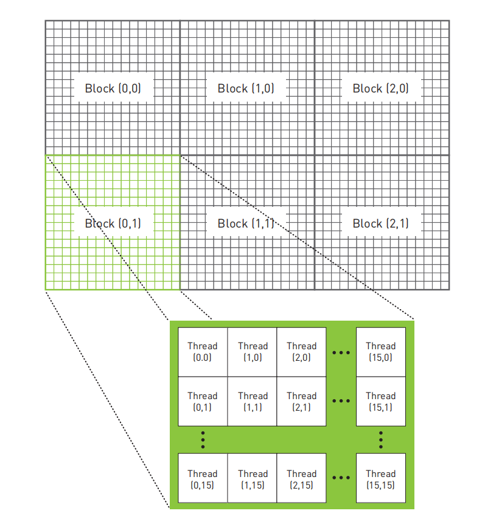

前面几章主要是对参考书目的内容进行一个概括。本章将根据参考书目的内容对所学到的所有函数进行一个整理和总结，以便复习和参考。英伟达的官方网站包含了所有的CUDA函数，可参考https://developer.download.nvidia.cn/compute/DevZone/docs/html/C/doc/html/index.html

<!--more-->

## 基本语法

这部分将介绍一下CUDA的基本语法，即参数的创建、传递、释放。


#### cudaMalloc

cudaMalloc函数的语法结构如下表示：

```c
cudaError_t cudaMalloc(void** devPtr, size_t size)
```

与C的malloc相似，cudaMalloc在设备上分配“size”字节大小的线性内存，并在*devPtr中返回一个指向所分配内存的指针。所分配的内存对于任何类型的变量都是适当对齐的。如果分配成功，则返回`cudaSuccess`，如果分配失败，则会返回`cudaErrorMemoryAllocation`。

注意，void** devPtr表示需要传递指针的地址。

#### cudaMemcpy

cudaMemcpy函数的语法如下所示：

```c
cudaError_t cudaMemcpy(void* dst, const void* src, size_t, count, enum cudaMemcpyKind kind)
```

将“count”字节从src指向的内存区域复制到dst指向的内存区。

dst是目标位置destination，src是源位置source。

kind用于规定复制的方向，总共有以下几种：

- cudaMemcpyHostToHost
- cudaMemcpyHostToDevice
- cudaMemcpyDeviceToHost
- cudaMemcpyDeviceToDevice

返回的值有：

- cudaSuccess
- cudaErrorInvalidValue
- cudaErrorInvalidDevicePointer
- cudaErrorInvalidMemcpyDirection

注：此函数还可能返回以前异步启动的错误代码。

#### cudaFree

cudaFree函数的语法如下所示

```c
cudaError_t cudaFree(void* devPtr)
```

释放devPtr指向的内存。与cudaMalloc()或者cudaMallocPitch()一一对应，对之前分配的内存进行释放。

返回的值有：

- cudaSuccess
- cudaErrorInvalidDevicePointer
- cudaErrorInitializationError

注：此函数还可能返回以前异步启动的错误代码。

#### 核函数

核函数前面需要加上\_\_global\_\_，此方法会将函数标记为设备代码“Device Code”。函数格式可以为：

```c
__global__ kernel(arguments)
```

进行函数调用的格式可以为：

```c
kernel<<<blocksPerGrid, threadsPerBlock>>>(arguments)
```

下面将详细介绍threads，blocks相关概念。也可以参考以下链接：https://zhuanlan.zhihu.com/p/675603584

CUDA里面用Grid和Block作为线程组织的组织单位，一个Grid可包含了N个Block，一个Block包含N个thread。

我们一般用得到的参数是gridDim, blockDim, blockIdx和threadIdx。

- gridDim: dim3类型，表示blocks在grid里面数量的维度。
- blockDim：dim3类型，表示threads在block里面数量的维度。
- blockIdx：dim3类型，表示blocks在grid里面的索引。
- threadIdx：dim3类型，表示threads在block里面的索引。



上图给了一个参考的thread和block的结构。在上面的结构中，一个grid有2\*3个block块，每个block块各有15\*15个thread。x轴是从左往右，y轴是从上到下(示例图片并没有显示z轴，即z轴最大值为1)。

如何获取某个thread的坐标，可以分为以下几步：

1. 计算thread在block中的位置
   $$
   threadInBlock = threadIdx.x + threadIdx.y * blockDim.x + threadIdx.z * blockDim.x * blockDim.y
   $$

2. 计算该block在grid中的位置
   $$
   blockInGrid = blockIdx.x + blockIdx.y * gridDim.x + blockIdx.z * gridDim.x * gridDim.y
   $$

3. 计算每个block的线程，计算得出某个thread的位置索引
   $$
   oneBlockSize = blockDim.x * blockDim.y * blockDim.z
   $$

$$
idx = threadInBlock + oneBlockSize * blockInGrid
$$

## 查询设备

#### cudaGetDevice

```c
cudaError_t cudaGetDevice(int* device)
```

将当前主机线程调用的设备索引返回给device的地址。

#### cudaGetDeviceCount

```c
cudaError_t cudaGetDeviceCount(int* count)
```

返回可执行的设备数量到count的地址。如果没有这样的设备，则返回cudaErrorNoDevice。如果无法加载驱动程序来确定是否存在任何此类设备，则返回cudaErrorInsufficientDriver。

#### cudaGetDeviceProperties

```c
cudaError_t cudaGetDeviceProperties(struct cudaDeviceProp* prop, int device)
```

将device的属性的信息传递给prop。cudaDeviceProp结构可以参考下面的链接：

https://developer.download.nvidia.cn/compute/DevZone/docs/html/C/doc/html/group__CUDART__DEVICE_g5aa4f47938af8276f08074d09b7d520c.html#g5aa4f47938af8276f08074d09b7d520c


## 内存

#### 共享内存(Shared Memory)

- 共享内存是在GPU的**每个线程块（block）中**共享的内存空间，用于线程之间的通信和数据共享。
- 共享内存的访问速度比全局内存更快，因为它位于芯片上，与处理器更近。
- 共享内存的使用需要程序员显式地将数据从全局内存复制到共享内存中，并在使用完毕后将数据写回全局内存。
- 共享内存在内核中的声明是在内核函数的参数列表之外使用 `__shared__` 关键字。

#### 全局内存(Global Memory)

- 全局内存是GPU中**所有线程**都可以访问的主要内存池，在设备内存中分配。
- 全局内存的访问速度相对较慢，因为它位于芯片之外，需要通过总线等方式与GPU核心通信。
- 全局内存通常用于存储大规模的数据，如数组、结构体等。
- 全局内存可以通过 `cudaMalloc` 分配内存，并使用 `cudaMemcpy` 在主机内存和设备内存之间进行数据传输。

#### 常量内存(Constant Memory)

- 常量内存是GPU上的一种只读内存，用于存储在GPU核心中被**所有线程共享的常量数据**。
- 常量内存通常用于存储对所有线程都是常量的数据，比如常量数组、常量参数等。
- 常量内存的优势在于其高速缓存和对齐的特性，可以加速访问频繁的常量数据。
- 常量内存的访问速度比全局内存更快，但相对来说容量较小。

- 常量内存通常在内核启动之前被初始化，并且其内容在内核执行期间不会改变。可以使用 CUDA 的 `__constant__` 修饰符定义常量内存，使用 `cudaMemcpyToSymbol` 将数据从主机内存拷贝到常量内存中。

以下是GPT生成的一个常量内存的使用例子：

```c
#include <cuda_runtime.h>
#include <stdio.h>

// 定义常量数组大小
#define ARRAY_SIZE 10

// 声明常量内存
__constant__ int constantArray[ARRAY_SIZE];

// CUDA内核函数
__global__ void kernel(int *result) {
    // 获取线程索引
    int idx = threadIdx.x;
    
    // 使用常量内存中的数据进行计算
    result[idx] = constantArray[idx] * idx;
}

int main() {
    int hostArray[ARRAY_SIZE];
    int *devResult;

    // 初始化常量数组
    for (int i = 0; i < ARRAY_SIZE; ++i) {
        hostArray[i] = i + 1;
    }

    // 分配设备端内存
    cudaMalloc((void**)&devResult, ARRAY_SIZE * sizeof(int));

    // 将常量数组拷贝到设备端常量内存中
    cudaMemcpyToSymbol(constantArray, hostArray, ARRAY_SIZE * sizeof(int));

    // 调用内核函数
    kernel<<<1, ARRAY_SIZE>>>(devResult);

    // 同步CUDA流，确保内核执行完成
    cudaDeviceSynchronize();

    // 将结果拷贝回主机端
    int result[ARRAY_SIZE];
    cudaMemcpy(result, devResult, ARRAY_SIZE * sizeof(int), cudaMemcpyDeviceToHost);

    // 打印结果
    printf("Result:\n");
    for (int i = 0; i < ARRAY_SIZE; ++i) {
        printf("%d ", result[i]);
    }
    printf("\n");

    // 释放设备端内存
    cudaFree(devResult);

    return 0;
}
```


## 操作

#### 原子操作

`atomicAdd(addr, val)`

读取地址addr处的值，将y增加到这个值，以及将结果保存回地址addr。

#### 原子锁

```c
int *mutex;
void lock(void){
    if(*mutex == 0){
        *mutex = 1; //将1保存到锁
    }
}
```

当mutex为0时，将数值1保存到锁，后续访问的时候如果mutex为1则无法进行后续任务。然而，如果在线程读取到0并且还没有修改这个值之前，另一个线程将1写入到互斥体，则两个线程都会执行后面的操作。要实现正确的操作，整个运算都要以原子方式来进行。

下面是lock的实现

```c
struct Lock{
    int *mutex;
    Lock(void){
        int state = 0;
        HANDLE_ERROR(cudaMalloc((void**)& mutex, sizeof(int)));
        HANDLE_ERROR(cudaMemcpy(mutex, &state, sizeof(int), cudaMemcpyHostToDevice));
    }
    
    ~Lock(void){
        cudaFree(mutex);
    }
    
    __device__ void lock(void){
        while(atomicCAS(mutex, 0, 1) != 0);
    }
    
    __device__ void unlock(void){
        atomicExch(mutex, 0);
    }
}
```

atomicCas()是一个原子操作。调用atomicCAS()将返回位于mutex地址上的值。**因此while循环会不断运行，直到atomicCAS发现mutex的值为0。当发现为0时，比较操作成功，线程将把1写入到mutex。**

通过atomicExch(mutex, 0)来重制mutex的值，将其与第二个参数进行交换，并返回它读到的值。


## 事件


## 线程同步

#### \_\_syncthreads

`__syncthreads()`函数的功能是**确保同一个线程块的线程**执行完该语句之前的所有语句。使用`__syncthreads()`需要注意的点是要确保所有线程都能够执行该语句，否则其他线程就会永远等待那些执行不了该语句的线程，从而停止下一步的执行。


注：CUDA并没有提供一个可以同步所有线程（包括不同线程块）的函数。这是因为CUDA的并行模型设计使得在不同线程块之间进行同步更加困难和昂贵。通常情况下，CUDA编程模型假设各个线程块是独立执行的，并且不会直接相互影响。


