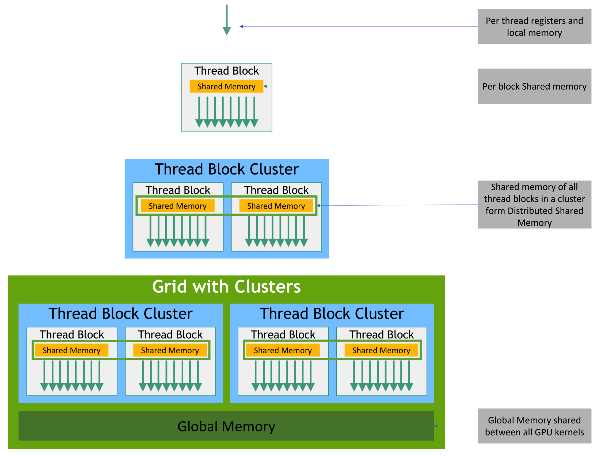
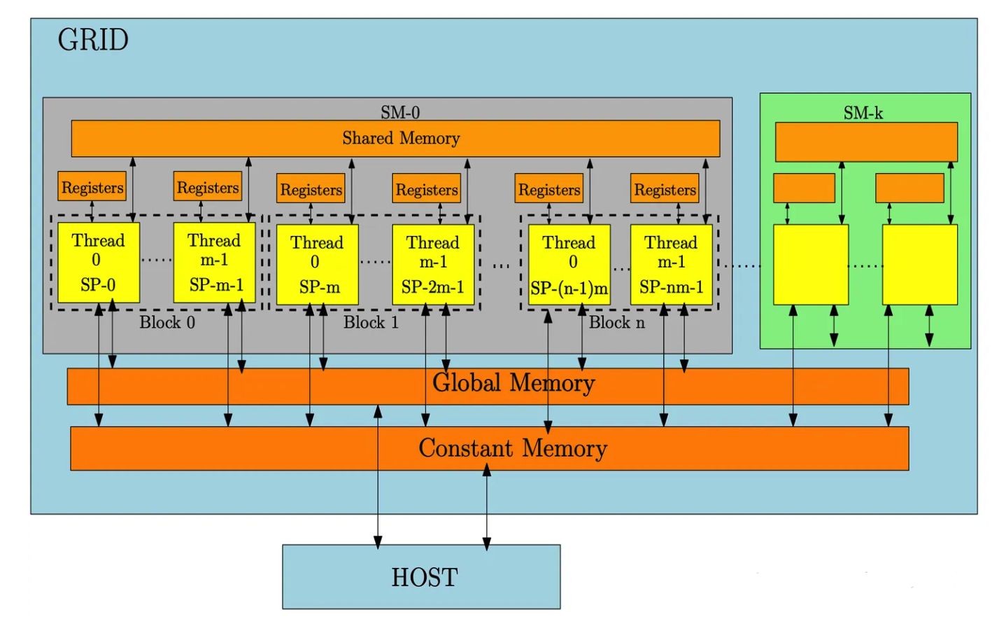

在学习CUDA过程中会遇到很多问题，而这些问题过于零碎，无法进行系统化的分类，所以这篇文章主要记录平时遇到的CUDA使用的知识点。

CUDA官方一堆的知识点: https://docs.nvidia.com/cuda/cuda-c-programming-guide/

<!--more-->

# cuda基础概念

### thread hierarchy

一个thread block的thread都在同一个multiprocessor core上，共享一个有限的内存资源。目前的GPU上一个thread block最多可以有1024个threads.

grid当中的thread block由data size决定，thread block数量一般都超过系统中processors的数量

同block的threads可以在共享内存中共享数据。也可以通过`__syncthreads()`来同步。

#### thread block clusters

更高层次的组织结构，包含多个thread blocks，适合在多个thread block之间协调任务。clusters也可以一维、二维或者三维。CUDA支持一个thread block cluster最多有8个thread block.

在kernel函数中使用`__cluster_dims__(X, Y, Z)`即可以使用thread block cluster

### memory hierarchy

每个thread都有各自的private local memory，一个thread block包含一个里面的thread都可以访问的shared memory区域。所有的thread可以访问一个相同的global memory. 下面是英伟达官网给出的一个层级关系以及结构图:




### GPU硬件中的对应关系

https://zhuanlan.zhihu.com/p/670063380

在GPU硬件中，**运算单元被划分成了SM (stream multiprocessor) -->SP (streaming processor)的层次，而相对应的在软件上也划分了grid-->block-->thread这样的结构**。

#### SM (Stream Multiprocessor) 流式多处理器

每个SM都有自己的寄存器文件、共享内存和缓存等资源，并且拥有很多Core资源，可以同时执行多个线程，可以说SM是GPU中的可独立计算单元。

划分SM的原因:

- 通过划分SM的主要目的是提高GPU的并行计算能力和资源利用率。
- 在划分SM后，GPU就可以通过将将计算任务分解成多个小部分的工作分配给不同的SM并行执行，从而加快速度。
- 划分SM还可以避免不同计算任务之间的资源竞争，提高GPU并行性能。

一个SM由多个CUDA core组成，每个SM根据GPU架构的不同有不同数量的CUDA core.在这种情况下，由哪些线程资源来占有这些稀缺资源执行任务，就离不开Warp Scheduler调度器。

#### Warp 线程束

warp是最基本的执行单元，一般一个warp包含了32个并行的thread，这些thread只能执行**相同的指令**。假如一个SM最大只能存储1024个线程的信息，但一个SM可以拥有超过1024个线程。此时就需要使用warp来对线程进行调度。

- 在一个SM中，可以有多个warp同时处于“活动”状态，但在某一时刻，SM只能真正执行某些warp，而其他warp会等待调度。
- Warp并发主要体现在调度上。SM在同一个时间片内可以执行多个warp，也就是并发调度，但并不意味着这些warp真正“并行”执行。SM 会根据资源（如寄存器、执行单元等）在warp之间切换，以保持高效的利用率。因此，在一个SM中，多个warp是并发调度的，但具体的并行执行量取决于硬件资源。
- **一个warp内的线程**：在硬件支持下，warp内的32个线程会一起调度，并且在同一个指令上执行不同的数据。尽管硬件层面可能会将这些线程分批处理，但从逻辑上它们是同时执行的。
- **SM内多个warp**：在一个SM内，可以有多个warp被并发调度，但在某一时刻，只有部分warp真正在执行。其他warp可能在等待调度或因资源限制而暂时停顿。

#### CUDA编程模型与GPU的映射关系

在软件层面，我们会将计算任务分成多个可并行的子块，交给thread block来计算，在thread block内部，我们再将任务进一步划分成多块，由每个thread计算。GPU硬件也是采用了分层次的组织方式，被划分成多个SM，每个SM内部又有多个CUDA Core。CUDA thread和thread block最终是运行在CUDA Core和SM上面。

一个grid可以包含多个SM，也可以访问global memory和constant memory

一个block只能存在于一个SM中，而且一个SM包含多个block，每个block内的thread可以访问自己block的shared memory

一个block有多个warp，每个warp有32个thread

下图展示了一部分的映射关系:




# c++中与GPU有关的操作

#### thrust

thrust是C++的一个扩展库，其中thrust::device\_vector用于在设备（GPU）内存中存储数据。我们可以在host中通过创建thrust::device\_vector来创建一个存储在device的vector并赋值。下面是一个例子:

```c
#include <thrust/device_vector.h>
#include <thrust/host_vector.h>
#include <iostream>

int main() {
    // 创建并初始化 host_vector
    thrust::host_vector<int> h_vec(5);
    h_vec[0] = 1; h_vec[1] = 2; h_vec[2] = 3; h_vec[3] = 4; h_vec[4] = 5;

    // 将数据从 host_vector 复制到 device_vector
    thrust::device_vector<int> d_vec = h_vec;

    // 可以在 CPU 上通过 host_vector 访问 device_vector 的内容
    thrust::host_vector<int> h_vec_copy = d_vec;
    for (int i = 0; i < h_vec_copy.size(); i++) {
        std::cout << h_vec_copy[i] << " ";
    }
    std::cout << std::endl;

    return 0;
}
```

此外，我们也可以直接对device\_vector进行赋值，比如`thrust::device_vector<int> d_vec = {1, 1, 1};`，但是在host端我们仍然无法直接访问device\_vector的值。

使用thrust的拓展可以简化CUDA编程，尤其是内存的管理和数据传输。

thrust::copy用于在GPU和CPU之间复制数据。下面的例子是具体用法:

```c
int main() {
    // 创建主机向量并初始化
    thrust::host_vector<int> h_vec(5);
    h_vec[0] = 10; h_vec[1] = 20; h_vec[2] = 30; h_vec[3] = 40; h_vec[4] = 50;

    // 创建设备向量并分配内存
    thrust::device_vector<int> d_vec(5);

    // 从主机向量复制到设备向量
    thrust::copy(h_vec.begin(), h_vec.end(), d_vec.begin());

    // 从设备向量复制回主机向量
    thrust::host_vector<int> h_vec_copy(5);
    thrust::copy(d_vec.begin(), d_vec.end(), h_vec_copy.begin());

    // 打印结果
    for(int i = 0; i < h_vec_copy.size(); i++) {
        std::cout << h_vec_copy[i] << " ";
    }
    std::cout << std::endl;

    return 0;
}
```

